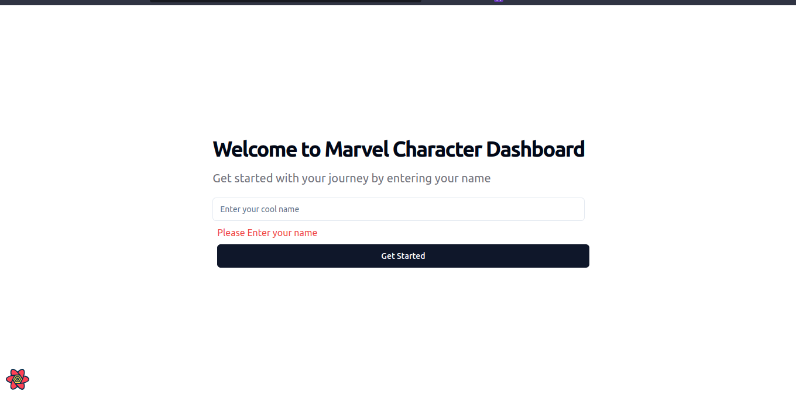
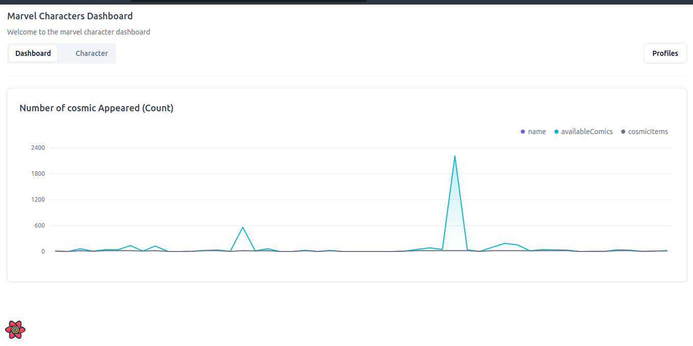
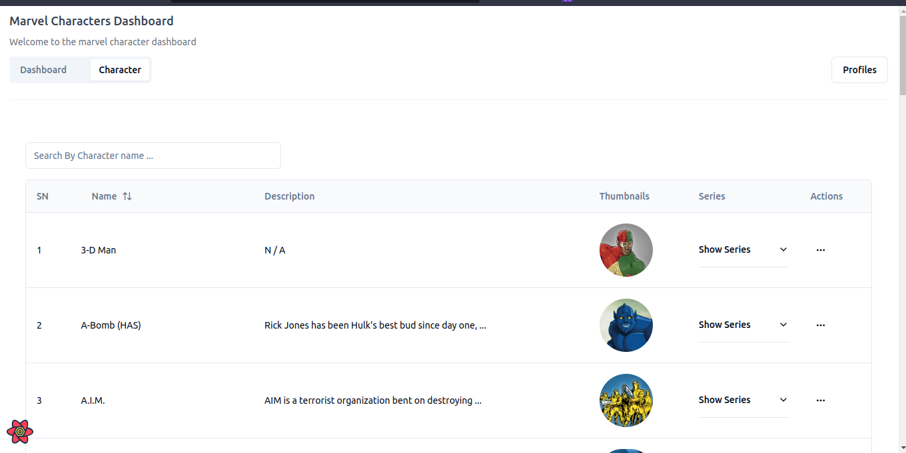
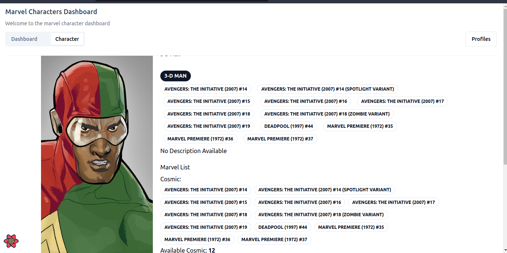

# Marvel Universe Dashboard Challenge

Welcome to the Marvel Universe Dashboard Challenge! This project is a web application built with React that connects to the Marvel API to retrieve and display real-time data about Marvel characters.

## Project Overview

The Marvel Universe Dashboard includes the following features:

- Fetching and displaying characters in real-time.
- Displaying characters in a data table with pagination.
- Clicking on a character row navigates the user to the character's profile page.
- The character profile page displays detailed information, including name, description, thumbnails, comics appeared in, series, and more.
- A charting library is used to represent characters based on the number of comics they've appeared in.
- A filter enables users to enable or disable characters in the graphical representation.
- Real-time search functionality allows users to search by character name.
- The application is responsive and works on different devices (desktop, tablet, and mobile).
- Cross-browser compatibility is ensured by testing the application on multiple browsers.

## Getting Started

This Markdown document is meant to help individual how it looks like It includes images related to different aspects of the project or application.

